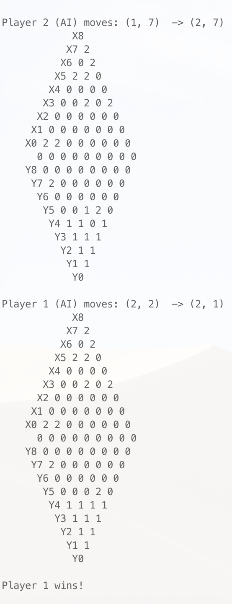

## Welcome to my portfolio

Here I occasionaly publish my projects.

# Current Projects

## MinEjendom iOS app

### Tech stack
Swift, UIKit, XCode, MongoDB, Node.js, REST API.

[![][image]][hyperlink]

  [hyperlink]: http://minejendom.dk
  [image]: https://process.filestackapi.com/AWdLLpMAFSGo8szRqg1dAz/urlscreenshot=mode:window,height:1080,width:1080,delay:2000/crop=dim:[0,0,1080,720]/resize=width:600/http://www.minejendom.dk

# Previous Projects

## Chineese Checkers AI

Implemented in Java interfaced to via terminal.
Uses Alpha-beta pruned Mini-max algorithm optimised via heuristics function based on distance to the center line, which was showed to win more than when using euclidean or manhatten distance.

### Tech stack
Java, System I/O (In other words `terminal`).

## Chatbot project
*June 2019*

Developed a NLP-chatbot for use in financial company. The Chatbot is interactive in the sense that it can directely manipulate the website based on what actions you ask it to execute. Also it can answer questions by searching through a database of information and extract the text that most likely is the answer to the question via machine learning.

### Tech stack:
Dialogflow, Node.js, Bootstrap, jQuery, HTML, CSS, mySQL, REST API.

<iframe src="https://drive.google.com/file/d/1X7G4s9m7PCDrZ6OJnGjLcYl2vseJ7aMS/preview" width="640" height="480"></iframe>

## Multiplayer Online Snake
*January 2019*

### Abstract
> This report details the implementation of a distributed application in the form of a multiplayer game. We have designed the game to be a real-time multiplayer combination of TRON, Achtung Die Kurve and Superhex, three ‘Snake’-like games. The multiplayer aspect was implemented using the pSpace-library (jSpace). A big emphasis of the architecture was to secure against malicious activities. In order to ensure a responsive feel for the players and no advantage for any given player, a separate server-client relationship was implemented, and all the game logic was implemented server side. This also makes it difficult for players to cheat, since the only communication from the client to server is movement commands. The game also includes a chat system for the different users to communicate with each other during a game.

### Tech stack:
Java, jSpace (Distributed Algorithm), JavaFx (UI).

<iframe src="https://drive.google.com/file/d/1U5i7INCZlc2znHz_QpiXmjFvmaPMfmfi/preview" width="640" height="480"></iframe>

## Apple ARKit Special Course
*June 2018*

Created a special course and gathered a team. We implemented an Augmented Reality iOS app for use in SMEs. It made it possible to localise an visualise IOT-sensors inside buildings. This would make maintenance of IOT-sensors more convenient and user friendly.

### Tech stack:
Swift, UIKit, ARKit, XCode.

<iframe src="https://drive.google.com/file/d/1XRKcSjee7M-nRq8RuQ1biik8B3mC2l2G/preview" width="640" height="480"></iframe>

## Microsoft Hackathon Skyscanner app
*April 2018*

Together with my team we developed a AR app for [Skyscanner](http://skyscanner.com), that was able to localise near countries and create an overview of the travel destination.

### Tech stack:
Swift, ARKit, XCode, Skyscanner API.

<iframe src="https://drive.google.com/file/d/1iQA-db3B6O78eNa3HCK_TW6_5wdbJmI3/preview" width="640" height="480"></iframe>

## Vink Game

*March 2018*

Danish Social Game App where poeple on your team has to guess a collection of words that you describe by either gestures, sounds, talk or miming.

### Tech stack:
iOS, UIKit, Autolayout, Swift.

[![][vink]][vinkLink]

  [vinkLink]: https://apps.apple.com/dk/app/vink/id1344789638
  [vink]: vink.png
